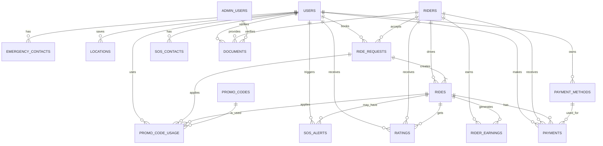

# Bike Taxi Platform - ER Diagram (Mermaid)



---

## How to Render as PNG

- **VS Code:** Install the "Markdown Preview Mermaid Support" or "Markdown Preview Enhanced" extension. Open this file and preview the diagram, then export as PNG.
- **Online:** Copy the diagram code block to [Mermaid Live Editor](https://mermaid.live/) and export as PNG.
- **CLI:** Use [Mermaid CLI](https://github.com/mermaid-js/mermaid-cli) to generate a PNG:
  ```bash
  mmdc -i ER_Diagram_Mermaid.md -o er_diagram.png
  ```

**This file contains only the ER diagram for easy rendering and sharing.** 